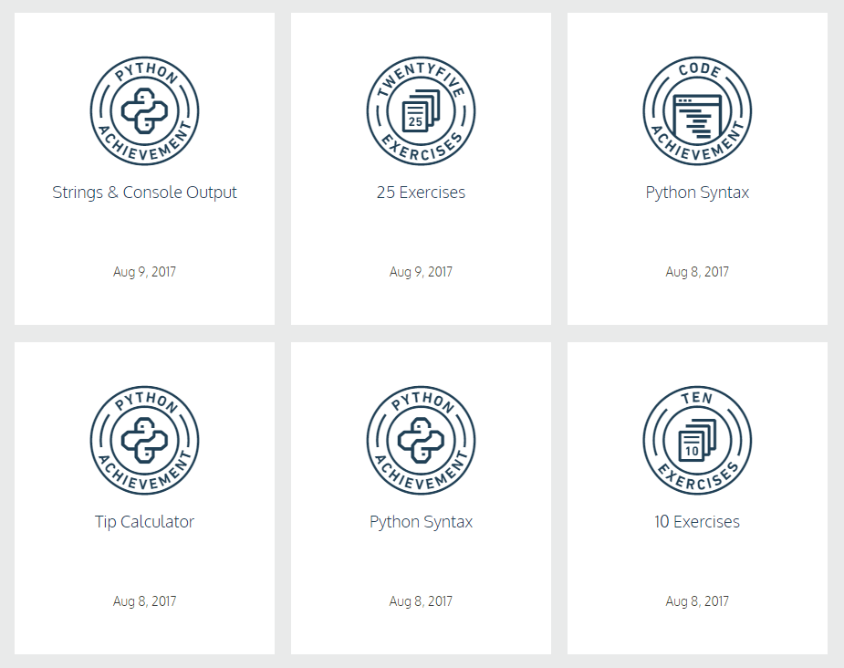
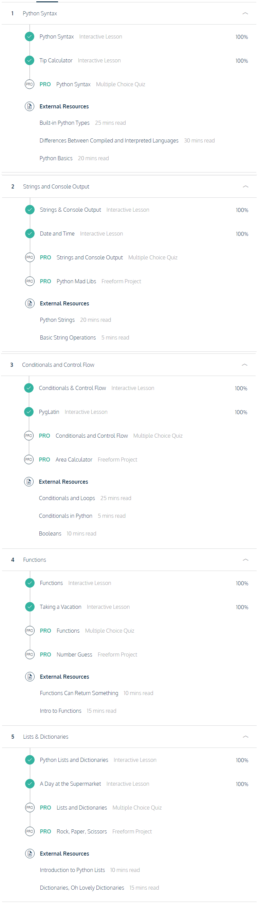
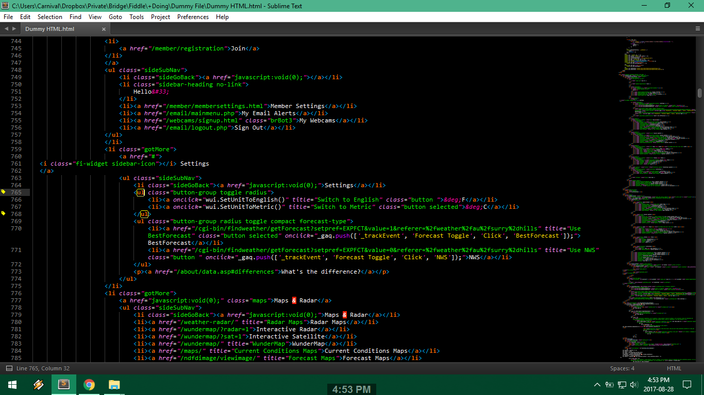
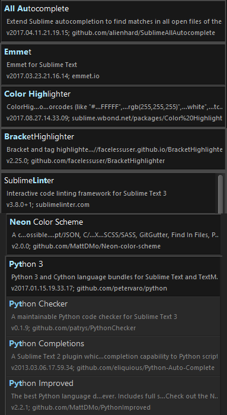
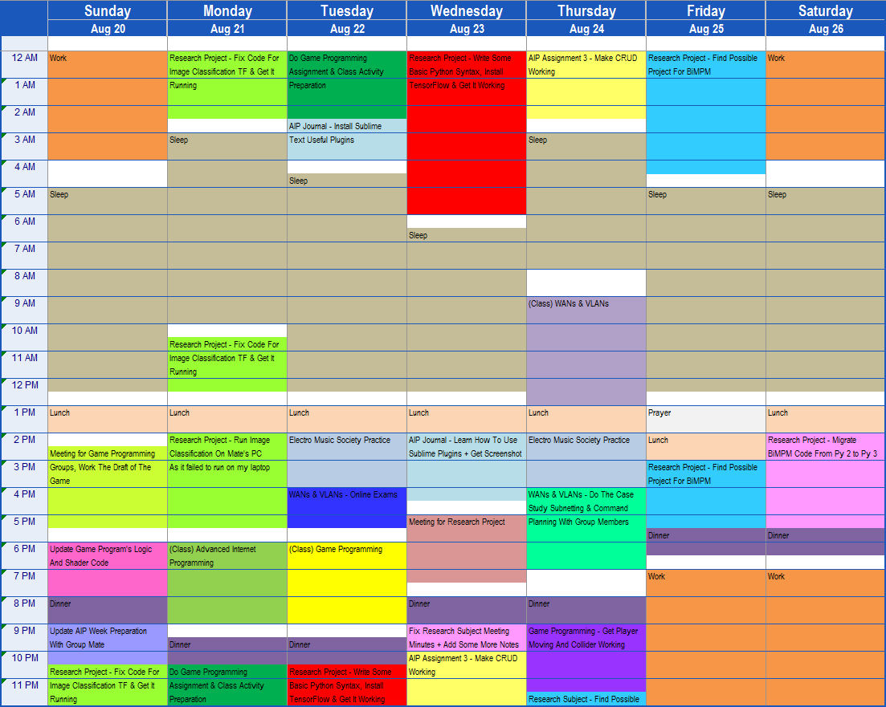
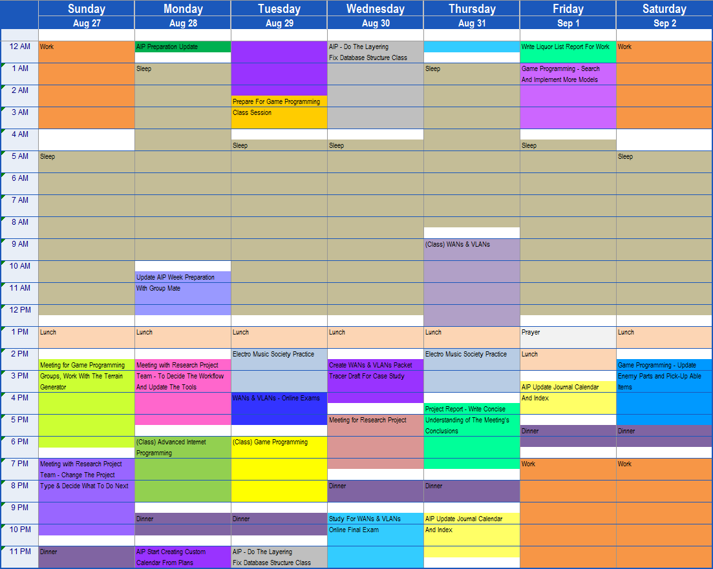
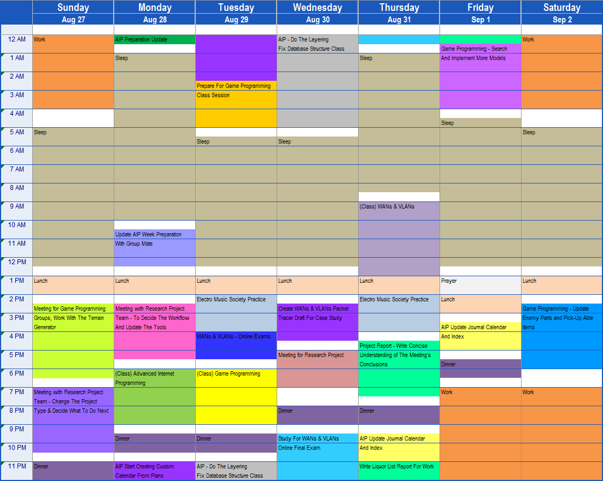
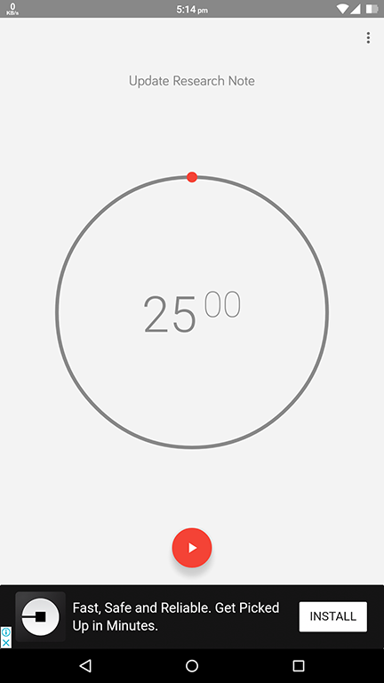
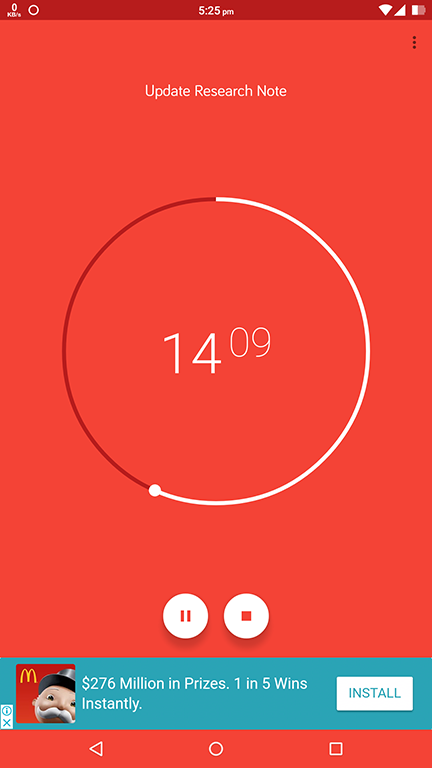

# Advanced Internet Programming Journal

## Week 2 (Starting 31st July)

### Chosen Task:

- None *(skipped the class, I was sick)*

### Evidence:

- Not available *(skipped the class, I was sick)*

## Week 3 (Starting 7th August)

#### Chosen Task:

- **Take an online course** from *Category 3: Personal Development and Productivity*

#### Evidence:

After I have the information that our group is going to use python, I took some times to figure out how to use it as I never use it before, and then I found this website called CodeCademy and viewed many positive feedback from their user and I decided to give it a shot for python as their free service.

Click [here](https://www.codecademy.com/learn/python) to access the Python tutorial from CodeCademy for free.

CodeCademy provide a decent environment for a beginner to learn how to code, for example as for me, I found it very easy just to type snippet and then press run button, then CodeCademy will check whether my code mathes with the problem's solution or check the output from it.

Because I never use Python before, I have no understanding about it, and it surprise me how different Python from other language is, because I usually use C# and over there I use semi-colon as a terminator, but in Python there's nothing like it, Python use indentation as its structure, so, the user/coder has to decide wether to use tab or space as indent, both can't be used together. This environmental limitation also caused me to make some novice error, as I code, I usually use tabs for indenting, but in Python, it's actually encouraged to use spaces. There was an undetectable error (by eyes) because of the indentation rule, because I accidentally put a space in front of the code.

---

> Not all result displayed, just some for evidence purpose





## Week 4 (Starting 14th August)

#### Chosen Task:

- **Read the code** from *Category 3: Personal Development and Productivity*

#### Evidence:

First, because I haven't used django before, I start from the Django tutorial and read the code which provided over there on the official documentation, here's the useful links:

1. [Django Tutorial](https://docs.djangoproject.com/en/1.11/intro/)
2. [Django Fields](https://docs.djangoproject.com/en/1.11/ref/models/fields/)
3. [Django ModelForms](https://docs.djangoproject.com/en/1.11/topics/forms/modelforms/)

Here, I also added the link to django tutorial playlist hosted on YouTube:

<a href="https://www.youtube.com/watch?v=qgGIqRFvFFk&list=PL6gx4Cwl9DGBlmzzFcLgDhKTTfNLfX1IK&index=1" target="_blank"></a>

After watched some of the videos and read the tutorial codes, I tried to do it myself, the code written below is django's code to generate database table based on the model, and below we can see the example of my code:

```python
from django.db import models

class User(models.Model):
    email = models.EmailField(max_length=70, blank=False)
    username = models.CharField(max_length=200, null=False, blank=False, unique=True)
    password = models.CharField(max_length=200, null=False, blank=False)
    first_name = models.CharField(max_length=40, null=False, blank=False)
    last_name = models.CharField(max_length=40, null=True, blank=True)
    mobile = models.CharField(max_length=15, validators=[phone_regex], blank=True)
    address = models.CharField(max_length=200, null=True, blank=True)
    blood_type = models.IntegerField(choices=BLOOD_CHOICES, default=0, null=False, blank=False)
    verified = models.BooleanField(default=False)
    def __str__(self):
        return self.username
```

From the code above, you can see some database like variable type, like *CharField*, *IntegerField*, and *BooleanField*, there are also some constraints related to each type, such as *max_length*, *blank*, *null*, and *default*

Now, let's see the next code:

```python
from django.shortcuts import get_object_or_404, render
from django.http import HttpResponseRedirect
from django.views import generic
from django.shortcuts import redirect

from .models import User
from .forms import UserForm

def add_user(request):
    if request.method == "POST":
        form = UserForm(request.POST)
        if form.is_valid():
            model_instance = form.save(commit=False)
            model_instance.timestamp = timezone.now()
            model_instance.save()
            return redirect('/bloodline')
    else:
        form = UserForm()
    return render(request, "bloodline/add_user.html", {'form': form})
```

That was the code which are able to 'serve' the request from the user, that code provided some function such as request type and response type, which is very useful for the dev, since later in their project, if they want to code about specific response or request, they don't need to type 2 different classes to do it, they just need to type one class, but different functions.

Next is django's form class, which is very simple:

```python
from django import forms

from .models import User

class UserForm(forms.ModelForm):
    class Meta:
        model = User
        fields = ['email', 'username', 'password', 'first_name', 'last_name', 'mobile', 'address', 'blood_type', 'verified']
```

You might be thinking 'why is it so short?' I was thinking the same thing, but this form is created based on the model from the first code, so error handling and input error checking is done by django, isn't that hefty?

---

As other code that I read from git, here it is:

```python
# -*- coding: utf-8 -*-
from django.http import HttpResponse

def index(request):
return HttpResponse("Hello, world!")
```

On the example [code](https://github.com/django-ve/helloworld/blob/master/helloworld/views.py) above, we can see and understand how Django basic request looks like, that code means, whenever the definition 'index' is called, the definition will return the http response, in this case it's just basic string saying "Hello, world!".

Below, we have routing example code for Django, it's called [urls.py](https://github.com/django-ve/helloworld/blob/master/helloworld/urls.py)

```python
# -*- coding: utf-8 -*-

from django.conf.urls import patterns, include
from django.conf import settings

# Uncomment the next two lines to enable the admin:
from django.contrib import admin
admin.autodiscover()

urlpatterns = patterns('',
    # Example:
    # (r'^helloworld/', include('helloworld.foo.urls')),

    # Uncomment the admin/doc line below to enable admin documentation:
    (r'^admin/doc/', include('django.contrib.admindocs.urls')),

    # Uncomment the next line to enable the admin:
    (r'^admin/', include(admin.site.urls)),

    # Hello, world!
    (r'', 'helloworld.views.index'),
)
```

We can see that in that example, the routing of the site itself is configured in a list(?), on the first index of the urlpatterns, the line is actually stating that if the user go into the /admin/doc/ they will be served with the default admind documentation that are provided by Django itself
On the second index is quite obvious, it directs the user to the admin page (and user authentication is implemented here).
As at the last index, we have the line which route to the view that was mentioned before the index view.

## Week 5 (Starting 21st August)

#### Chosen Task:

- **Cutomize an advanced editor** from *Category 3: Personal Development and Productivity*

#### Evidence:

I saw some of the tutor here use very cool text editor, he can do things like magic, with a few word, he then send the commands to generate a full skeleton for html, so this week, I want to get my text editor to do the same thing as that (at least), and I've been using sublime text for about 2 months now, I read there are so many plugins are able to be installed on it, let's see how's mine looks like AFTER the customization:



That was very different from your daily 'standard' sublime text, I short researched about what's good plugins to use on every webstie I can find, and if you're curious what kind of plugins did I use, here's some list of it:



After all of this customization, I can say that the plugins help me a lot, like emmet for example, I just need to type this:

- **div#header+div.page+div#footer.class1.class2.class3**

To get this result:

```html
<div id="header"></div>
<div class="page"></div>
<div id="footer" class="class1 class2 class3"></div>
```

Almost all plugins in the top 100 list [here](http://packagecontrol.io/) is very useful, I installed some of them and I can see the difference, just be careful, you might need to install just ones you need, because some of the plugins actualy slows the Sublime Text down, and there are one plugin that I thought might be useful, then it made me disable it, it's called [DictionaryAutoComplete](https://packagecontrol.io/packages/DictionaryAutoComplete), this plugins made me work a little bit slower a bit, because it's actually suggesting some numbers right after I type something, and if I want to press return, it put that number in the end of my text instead of going into the new line.

## Week 6 (Starting 28th August)

#### Chosen Task:

- **Reflect on and improve your time management** from *Category 3: Personal Development and Productivity*

#### Evidence:

In the last class, I told Ben that I'm very busy and kind of overwhelmed by the assignments for all of my subject for this semester, and here's my last week's schedule looks like:



As we can see there, I don't even have some free time, and it's all a verty stressing works (at least for me, maybe not for anyone), and then as the task information suggested, I made the template of what I will do for the current week:



There we can see the plan is pretty much pushed by the *Research Project*, and I do feel it's taking a lot of my time, but also with *Advanced Internet Programming*, because last week I spent hours just to figure out how CRUD works for django, maybe this kind of problem is not for everyone (again, maybe it's just my limited knowledge which cause this, as I never use django before), and here's roughly what really happened:



Most of the time it's according to the plan, but there's some work taking much longer than it should, and there's work which take less longer than planned, I can say this time management is pretty good, because before I plan of what I'm going to do, I was kind of ***lost track*** of what I'm going to do next, but, making the schedule itself exhaust me to be honest.

## Week 7 (Starting 4th September)

#### Chosen Task:

- **Reflect on and improve your focus** from *Category 3: Personal Development and Productivity*

#### Evidence:

[Pomodoro](https://en.wikipedia.org/wiki/Pomodoro_Technique) is a time management technique that was founded on 1980s, in this week of the task, to continue making my focus better combined with the task I've choosen last week, I decided to use this technique on myself, because I feel like I'm really easy to get distracted, I tried many of technique already but none of them actually made me work through my objective better than this pomodoro technique, it might be because of the rest time, so basically here's what I did:



On the first three days this pomodoro technique doesn't really affect my so called habit, I still tend to wander around while doing my work, but on the fourth day, I actually feel that this pomodoro helped me quite much, I can see that I finish more work than before I used this technique, I mean, it's just 25 minutes, it's not that much, but it actually does much.
Week before, I was planning to implement the anagram word search for my research, but I finished it in 3 days, because I wander a lot (especially on the web), but with this (and the commitment to not to wander, it's just 25 minutes anyway, right?) that kind level of task actually finished in a day!
It's not really that shocking for me, since I realize that I can be easily distracted, but this is the first time that I actually tried this technique and gained something out of it, I recommend people who like to 'delay' their work do this technique as well with 'it's easy, just 1 session of 25 minutes of focus' then you're good to go, you won't know what will this small technique will do to you.

## Week 10 (Starting 11th September)

#### Chosen Task:

- **** from *Category *

#### Evidence:

1. [EVIDENCE HERE]
